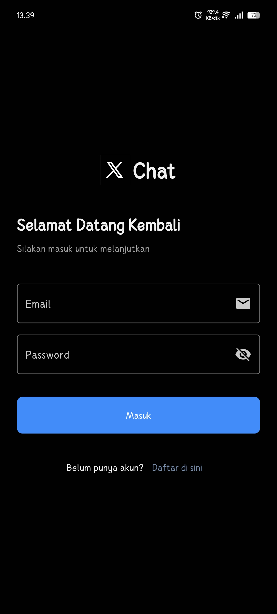
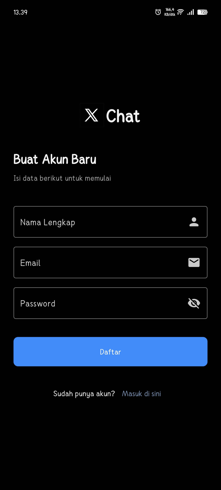
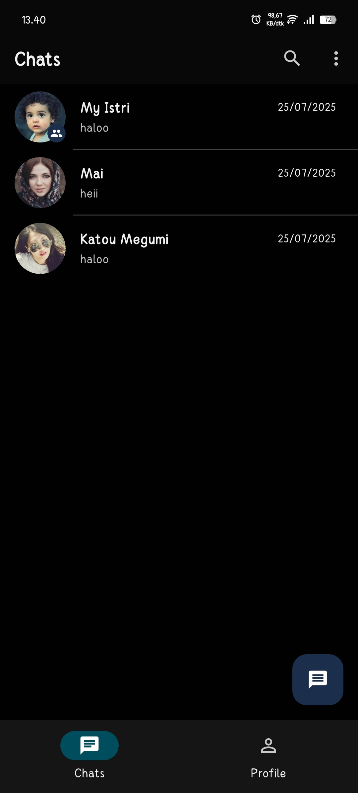
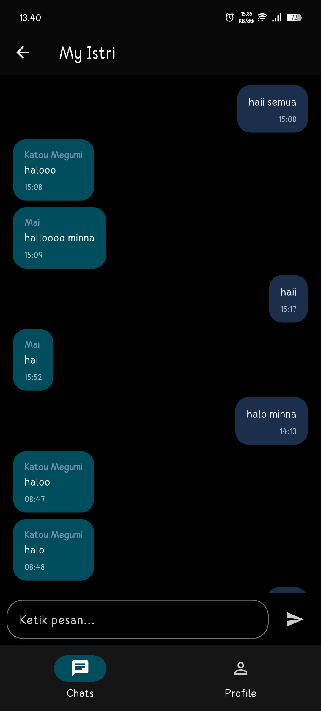

# XChat - Real-time Chat Application with Flutter

<p align="center">
  
  
  
</p>

This is the **frontend** repository for the XChat application. The corresponding backend repository (built with Go-Fiber) can be found here:
**Backend Repository**: [https://github.com/Kirara02/Go-Fiber-ChatApp.git](https://github.com/Kirara02/Go-Fiber-ChatApp.git)

XChat is a functional mobile application built using Flutter to provide a modern, fast, and reliable instant messaging platform. This application is designed with Clean Architecture to ensure the code is manageable, scalable, and testable.

## Application Screenshots

Here are some of the main screens of the XChat application:

<table align="center">
  <tr>
    <td align="center"><strong>Login Screen</strong></td>
    <td align="center"><strong>Register Screen</strong></td>
  </tr>
  <tr>
    <td valign="top"></td>
    <td valign="top"></td>
  </tr>
  <tr>
    <td align="center"><strong>Chats List</strong></td>
    <td align="center"><strong>Chat Room</strong></td>
  </tr>
  <tr>
    <td valign="top"></td>
    <td valign="top"></td>
  </tr>
</table>

## Key Features

- **User Authentication**: Complete flow for Register, Login, and Logout.
- **Chats List**: Displays all chat rooms (private and group) with the last message and timestamp.
- **Real-time Chat**: Instant two-way communication using WebSockets.
- **Clean Architecture**: Clear separation between Presentation, Domain, and Data layers.
- **Modern State Management**: Uses Riverpod for reactive and efficient state management.
- **Error Handling**: Robust mechanism for handling network errors.

## Technology & Architecture

This project is built with a modern technology stack for Flutter application development:

- **Framework**: [Flutter](https://flutter.dev/)
- **Language**: [Dart](https://dart.dev/)
- **State Management**: [Riverpod](https://riverpod.dev/) with [Riverpod Generator](https://pub.dev/packages/riverpod_generator) for boilerplate-free code.
- **Networking**:
  - [Dio](https://pub.dev/packages/dio) for HTTP requests (REST API).
  - [web_socket_channel](https://pub.dev/packages/web_socket_channel) for WebSocket communication.
- **Routing**: [GoRouter](https://pub.dev/packages/go_router) with Typed Routes for safe navigation.
- **Architecture**: Adopts **Clean Architecture** principles with the following layers:
  - **Presentation**: UI (Widgets) and Controllers (Notifiers).
  - **Domain**: Usecases and entity Models.
  - **Data**: Repositories and DataSources (remote/local).

## Getting Started

To run this project in your local environment, follow these steps:

### Prerequisites

- Ensure you have the [Flutter SDK](https://docs.flutter.dev/get-started/install) installed (version 3.x or newer).
- An IDE like VS Code or Android Studio.

### Installation

1.  **Clone this repository:**

    ```bash
    git clone [https://github.com/YOUR_USERNAME/xchat.git](https://github.com/YOUR_USERNAME/xchat.git)
    cd xchat
    ```

2.  **Install dependencies:**

    ```bash
    flutter pub get
    ```

3.  **Run the code generator:**
    Riverpod Generator is used to generate providers. Run the following command to generate the necessary files (`.g.dart`):

    ```bash
    flutter pub run build_runner watch --delete-conflicting-outputs
    ```

4.  **Run the application:**
    Ensure you have a running emulator or a connected physical device, then run:
    ```bash
    flutter run
    ```

## Project Structure

The project's directory structure is designed to be easily navigable and scalable:

```
lib/
├── src/
│   ├── core/                # Core logic, such as networking, result type, etc.
│   ├── features/            # Main features of the application
│   │   ├── auth/            # Authentication feature (login, register)
│   │   │   ├── data/
│   │   │   ├── domain/
│   │   │   └── presentation/
│   │   └── main/            # Main feature after login (chats, chat room)
│   │       ├── data/
│   │       ├── domain/
│   │       └── presentation/
│   ├── global_providers/    # Global Riverpod providers
│   ├── routes/              # GoRouter configuration
│   └── utils/               # Utilities and extensions
└── main.dart                # Main entry point of the application
```

## Contribution

Contributions are highly appreciated! If you wish to contribute, please fork this repository and create a pull request. For major changes, please open an issue first to discuss what you would like to change.
